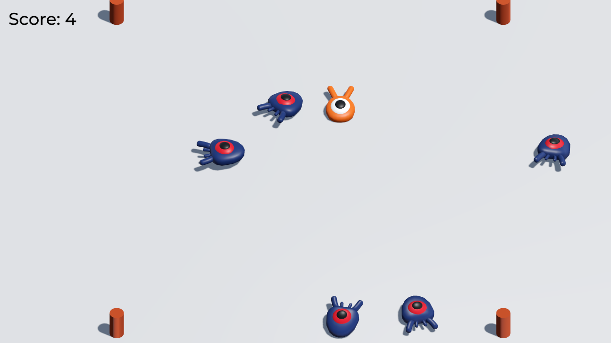

# Squash the Creeps (3D)

This is a simple game where your character must move
and jump to squash as many enemies for as long as possible.
You gain 1 point for every enemy squashed.

This is NOT the finshed game, but just a version with only the assets for ease of access to an uncomplete version of the game.

Language: GDScript

Renderer: Forward+

## Screenshots

## Copying

`art/House In a Forest Loop.ogg` Copyright &copy; 2012 [HorrorPen](https://opengameart.org/users/horrorpen), [CC-BY 3.0: Attribution](http://creativecommons.org/licenses/by/3.0/). Source: https://opengameart.org/content/loop-house-in-a-forest

Font is "Montserrat Medium". Copyright 2011 [The Montserrat Project Authors](https://github.com/JulietaUla/Montserrat). Details are in `fonts/LICENSE.txt`.
